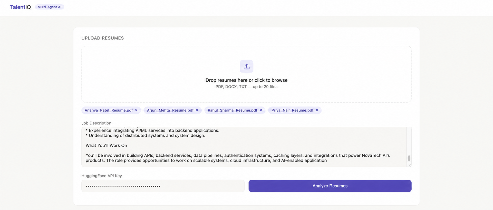
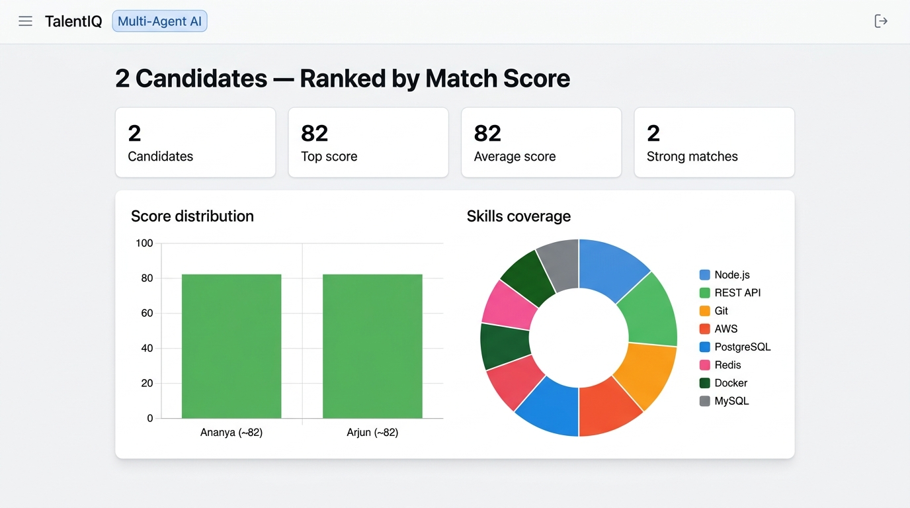
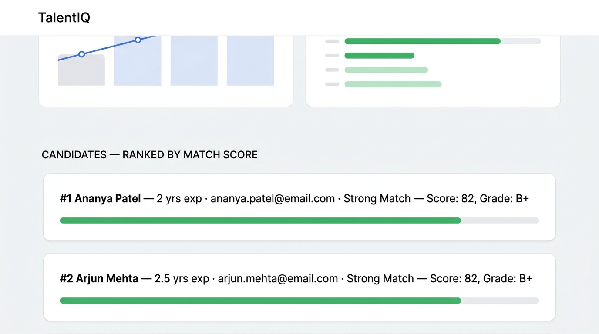

# TalentIQ — AI-Powered Resume Intelligence & Candidate Matching

> An end-to-end multi-agent AI pipeline that parses resumes, normalises skills against a curated taxonomy, and semantically matches candidates against a job description — powered by **Llama 3.3 70B** via the Hugging Face Inference API.

<p align="center">
  
</p>

<p align="center">
  
</p>

<p align="center">
  
</p>

---

## Table of Contents

1. [Project Overview](#1-project-overview)
2. [Key Features](#2-key-features)
3. [How the AI Pipeline Works](#3-how-the-ai-pipeline-works)
4. [System Architecture](#4-system-architecture)
5. [Tech Stack](#5-tech-stack)
6. [Project Structure](#6-project-structure)
7. [Installation](#7-installation)
8. [Environment Configuration](#8-environment-configuration)
9. [Running Locally](#9-running-locally)
10. [How to Use the Application](#10-how-to-use-the-application)
11. [API Endpoints](#11-api-endpoints)
12. [Limitations](#12-limitations)
13. [Future Improvements](#13-future-improvements)
14. [Author](#14-author)

---

## 1. Project Overview

TalentIQ is a multi-agent AI system for resume intelligence and candidate-job matching. It accepts resumes in PDF, DOCX, or TXT format, extracts structured candidate information using a large language model, normalises skills against a local taxonomy, and produces a detailed match report against a given job description.

The result includes an overall score (0–100), letter grade, match verdict, matched and missing skills, candidate strengths and gaps, and upskilling suggestions — all returned as structured JSON and rendered in a browser-based dashboard.

---

## 2. Key Features

- **Multi-format resume ingestion** — PDF, DOCX, and TXT supported
- **LLM-powered structured extraction** — name, email, phone, location, summary, skills, experience, education, certifications, projects
- **Skill normalisation** — local taxonomy lookup with LLM fallback for unknown skills
- **Semantic candidate-job matching** — score, grade, verdict, matched/missing/bonus skills
- **Strengths, gaps, and upskilling suggestions** — per-candidate narrative feedback
- **Batch processing** — up to 20 resumes ranked by match score in a single request
- **SQLite persistence** — candidates and jobs stored for later retrieval
- **Browser-based dashboard** — score charts, skill coverage visualisation, expandable candidate cards

---

## 3. How the AI Pipeline Works

```
Resume (PDF / DOCX / TXT)
        │
        ▼
┌──────────────────────┐
│  Agent 1 — Parser    │  Extracts raw text → sends structured prompt to
│  (agents/parser.py)  │  Llama 3.3 70B → returns JSON candidate profile
└──────────────────────┘
        │
        ▼
┌─────────────────────────────┐
│  Agent 2 — Normaliser       │  Maps raw skills to canonical names via local
│  (agents/normalizer.py)     │  taxonomy (data/taxonomy.json). Unknown skills
│                             │  are sent to Llama for best-effort mapping.
└─────────────────────────────┘
        │
        ▼
┌─────────────────────────────┐
│  Agent 3 — Matcher          │  Sends candidate profile + normalised skills +
│  (agents/matcher.py)        │  job description to Llama → returns score,
│                             │  grade, verdict, matched/missing skills, etc.
└─────────────────────────────┘
        │
        ▼
  Final Candidate Result
  (orchestrator.py assembles and saves to SQLite)
```

Each stage has independent error handling. A parsing or normalisation failure does not crash the pipeline — the orchestrator degrades gracefully and records which stages succeeded or failed.

---

## 4. System Architecture

```
Browser (frontend/index.html)
        │
        │  HTTP  (multipart/form-data)
        ▼
FastAPI (api.py)
  ├── POST /api/v1/parse          — single resume
  ├── POST /api/v1/parse/batch    — batch up to 20
  ├── GET  /api/v1/jobs/{id}/candidates
  ├── GET  /api/v1/skills/taxonomy
  └── GET  /api/v1/health
        │
        ▼
orchestrator.py  →  agents/parser.py
                 →  agents/normalizer.py
                 →  agents/matcher.py
                        │
                        ▼
               Hugging Face Inference API
               (meta-llama/Llama-3.3-70B-Instruct)
                        │
                        ▼
                  SQLite (talentiq.db)
```

**CORS** is currently open (`allow_origins=["*"]`) — appropriate for local development. Restrict before any production deployment.

---

## 5. Tech Stack

| Layer | Technology |
|---|---|
| LLM | `meta-llama/Llama-3.3-70B-Instruct` via Hugging Face Inference API |
| Backend | FastAPI 0.111, Uvicorn |
| PDF parsing | pdfplumber |
| DOCX parsing | python-docx |
| Data validation | Pydantic v2 |
| Database | SQLite (via stdlib `sqlite3`) |
| Frontend | Vanilla HTML/CSS/JavaScript, Chart.js |
| Skill taxonomy | Local JSON file (200+ canonical skills with aliases and hierarchy) |
| Environment | python-dotenv |

---

## 6. Project Structure

```
TalentIQ/
├── agents/
│   ├── parser.py          # Agent 1 — text extraction + LLM structured parsing
│   ├── normalizer.py      # Agent 2 — skill taxonomy lookup + LLM normalisation
│   └── matcher.py         # Agent 3 — semantic candidate-job matching
├── assets/                # Screenshots for README
│   ├── screenshot_1_upload.jpg
│   ├── screenshot_2_charts.jpg
│   └── screenshot_3_candidates.jpg
├── data/
│   └── taxonomy.json      # 200+ skills: canonical names, aliases, hierarchy
├── frontend/
│   └── index.html         # Single-page dashboard (upload, results, charts)
├── .env.example           # Template — copy to .env and fill in HF_API_KEY
├── .gitignore
├── api.py                 # FastAPI application and all HTTP endpoints
├── orchestrator.py        # Chains the three agents; handles errors per stage
├── requirements.txt
├── run.py                 # Convenience launcher (python run.py)
└── README.md
```

---

## 7. Installation

**Requirements**: Python 3.10+

```bash
# Clone the repository
git clone https://github.com/<your-username>/TalentIQ.git
cd TalentIQ

# Create and activate a virtual environment
python -m venv venv
source venv/bin/activate        # macOS / Linux
# venv\Scripts\activate         # Windows

# Install dependencies
pip install -r requirements.txt
```

---

## 8. Environment Configuration

TalentIQ requires a [Hugging Face](https://huggingface.co) account with access to the `meta-llama/Llama-3.3-70B-Instruct` model.

### Option A — `.env` file (recommended)

```bash
cp .env.example .env
# Open .env and set your key:
# HF_API_KEY=hf_your_token_here
```

The application loads this file automatically at startup via `python-dotenv`.

### Option B — Shell export

```bash
export HF_API_KEY=hf_your_token_here   # macOS / Linux
# set HF_API_KEY=hf_your_token_here    # Windows CMD
```

### Option C — UI input

Leave the environment variable unset. The browser UI has an **API Key** field; paste your Hugging Face token there before each session. This takes priority over the environment variable.

> ⚠️ **Never commit `.env` or any file containing your API key.** `.env` is listed in `.gitignore`.

---

## 9. Running Locally

```bash
python run.py
```

Or directly with uvicorn:

```bash
uvicorn api:app --reload --port 8000
```

Then open **http://127.0.0.1:8000** in your browser.

---

## 10. How to Use the Application

1. **Upload resumes** — drag-and-drop or click to browse. Accepts PDF, DOCX, TXT. Up to 20 files for batch mode.
2. **Paste the job description** — include requirements, responsibilities, and tech stack for best results.
3. **Enter your Hugging Face API key** — or leave blank if `HF_API_KEY` is set in your environment.
4. **Click "Analyze Resumes"** — the pipeline runs and results appear below.
5. **Review ranked candidates** — click any candidate card to expand strengths, matched skills, missing skills, and upskilling suggestions.

Single resume → result shown immediately.  
Multiple resumes → all processed and ranked by match score.

---

## 11. API Endpoints

All endpoints are available at `http://127.0.0.1:8000`.

### `GET /`
Serves the browser-based frontend (`frontend/index.html`).

---

### `POST /api/v1/parse`
Process a single resume against a job description.

**Form fields:**

| Field | Type | Required | Description |
|---|---|---|---|
| `file` | file upload | ✅ | PDF, DOCX, or TXT resume |
| `job_description` | string | ✅ | Full job description text |
| `api_key` | string | — | HF API key (overrides env var) |

**Response:**
```json
{
  "success": true,
  "job_id": "uuid",
  "candidate": {
    "candidate_id": "...",
    "name": "Jane Doe",
    "email": "jane@example.com",
    "total_experience_years": 5,
    "normalized_skills": ["Python", "FastAPI", "Docker"],
    "overall_score": 82,
    "grade": "B+",
    "verdict": "Strong Match",
    "matched_skills": ["Python", "FastAPI"],
    "missing_skills": ["Kubernetes"],
    "bonus_skills": ["Rust"],
    "strengths": ["..."],
    "gaps": ["..."],
    "upskilling_suggestions": ["..."],
    "summary": "..."
  },
  "processing_time": 4.2
}
```

---

### `POST /api/v1/parse/batch`
Process up to 20 resumes; returns candidates ranked by score.

**Form fields:** same as `/parse` but `files` (plural, multiple uploads).

**Response:**
```json
{
  "success": true,
  "job_id": "uuid",
  "total_processed": 5,
  "successful": 5,
  "ranked_candidates": [ /* array sorted by overall_score DESC */ ]
}
```

---

### `GET /api/v1/jobs/{job_id}/candidates`
Retrieve all previously stored candidates for a given job ID (from SQLite).

---

### `GET /api/v1/skills/taxonomy`
Returns the full skill taxonomy JSON — canonical names, aliases, and hierarchy.

---

### `GET /api/v1/health`
Health check. No API key required.

```json
{"status": "ok", "service": "TalentIQ"}
```

---

## 12. Limitations

- **API key required** — every parse request calls the Hugging Face Inference API. No offline mode.
- **Rate limits** — free-tier Hugging Face accounts have inference rate limits. Large batches may time out.
- **LLM non-determinism** — resume parsing quality depends on resume formatting and LLM response quality. Malformed LLM output is caught and handled but may result in empty fields.
- **File size** — very long resumes are truncated to 4 000 characters before being sent to the LLM.
- **CORS** — open (`*`) for local development only. Must be restricted for any public deployment.
- **No authentication** — there is no user account system. The app is designed for local / internal use.
- **SQLite** — suitable for development and personal use; not designed for concurrent multi-user production workloads.

---

## 13. Future Improvements

- [ ] Streaming LLM responses for faster perceived performance
- [ ] Persistent job boards — store multiple JDs and compare candidate pools
- [ ] Resume-to-resume comparison mode
- [ ] Configurable scoring weights (skills vs. experience vs. education)
- [ ] Export results as PDF or CSV
- [ ] Restrict CORS and add API key authentication for production deployment
- [ ] Support additional file formats (ODT, RTF)
- [ ] Unit and integration test suite

---

## 14. Author

**Sriram Abbaraju**

Built as a full-stack AI engineering project demonstrating multi-agent LLM pipeline design, FastAPI backend development, and browser-based data visualisation.

---

*TalentIQ is a portfolio / demonstration project. It is not production-ready and should not be used for real hiring decisions without appropriate review and validation.*
